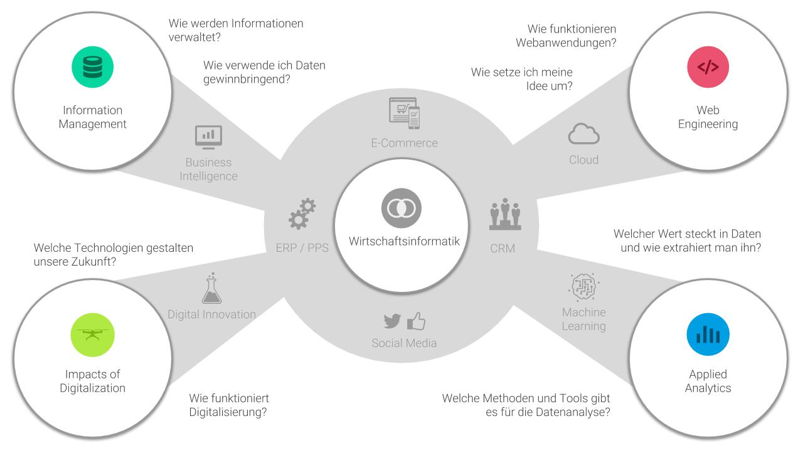

# Welcome

## Overview

## Recommended Path

If you want to maximize your skills and knowledge in digitalization & IT, you should enrol in all my courses. For that, I recommend the following paths.

### Bachelor

| **Semester** | **Module\(s\)** |
| :--- | :--- |
| 2. | [Wirtschaftsinformatik](wirtschaftsinformatik/) |
| 3. | [Information Management](information-management/) + [Web Engineering](web-engineering/) |
| 4. | [Impacts of Digitalization](impacts-of-digitalization/) |
| 5. | [Applied Analytics](applied-analytics/) |

### Master

If you subsequently enrol in the master program, you get the chance to take another course:

| **Semester** | **Module\(s\)** |
| :--- | :--- |
| 2. | [Big Data Analytics](big-data-analytics/) |

I am also involved in the two modules _Empirisches Arbeiten_ and _Planung und Entscheidung_ in the first semester of the master program.

