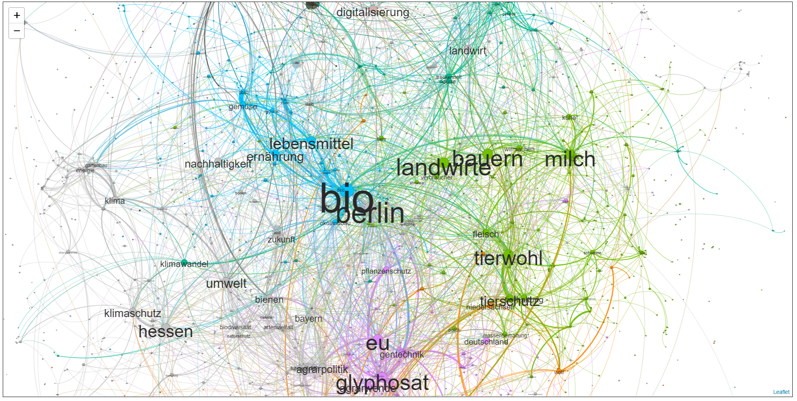

# \#02 - Chicago Crimes

## 1. Preparation

In this exercise, we'll use the Chicago Crimes 2018 data set. You can download the file in CSV-format [here](https://s3.amazonaws.com/nicolas.meseth/data+sets/crimes/crimes_chicago_2018.csv). Save the file on your computer and load it into Tableau. Make yourself familiar with the data and the available columns:

1. Check the data types Tableau has automatically inferred and change them if necessary!
2. See if there are any columns that provide no value for further analysis! Remove \(hide\) them from the data set!

## 2. Visualization Tasks

For each task, create a appropriate visualization on a separate sheet:

1. In which location type \(street, apartment, yard\) do most of the homicides happen? In which location types happened more than 10 homicides in 2018?
2. Create a visualization that shows the crimes on a map. Show all crimes that were handled by the same police station in the same color! Add a filter for the type of crime!
3. Which crime type has the highest probability that the offender is being arrested?
4. What percentage of battery incidents is domestic violence?
5. Which streets have a prostitution problem? \(**HINT**: How do we get the street?\)

## 3. Enhance the map visualizations

By default, Tableau can display different types of geolocation shapes such as countries or zip codes. However, in this data set we have neither of those. The good news is that tableau allows us to load custom geolocation shapes in predefined standard formats. Download [this file](https://s3.amazonaws.com/nicolas.meseth/data+sets/crimes/chicago_police_beats_boundaries.zip), which contains the polygon coordinates for the police beats \(German: "Reviere"\) in Chicago. Unzip it after it finished downloading,

1. Import the `.shp` file as a new data connection of the type "Spatial file". Perform a left-join with the condition `Beat = Beat Num`
2. Create a map with the newly imported beat polygons. Highlight beats with more crime incidents in red, those with less in yellow!

