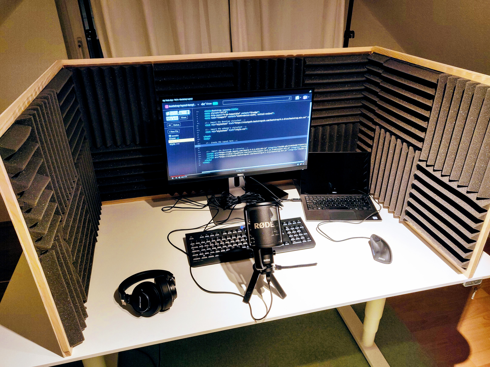

# Videos

All my videos are on  my YouTube channel under [this link](https://www.youtube.com/channel/UC4qYjwJaVh3uABOajAjUA0w/featured).

| Title | Duration |
| :--- | :--- |
| [My Todo App - Teil 1 - HTML](https://www.youtube.com/watch?v=K62YuAHHlBc) | 03:48 |
| [My Todo App - Teil 2 - CSS](https://www.youtube.com/watch?v=slVAbQKeT6s) | 13:28 |
| [My Todo App - Teil 3 - JavaScript - Clear List](https://www.youtube.com/watch?v=gADwe53QP1E) | 09:02 |
| [My Todo App - Teil 4 - JavaScript - Add Task](https://www.youtube.com/watch?v=UHlWDfDEu5Q) | 07:59 |
| My Todo App - Teil 5 - JavaScript - Mark Tasks Done / Undone |  |
| [My Todo App - Teil 6 - Bootstrap Layout](https://www.youtube.com/watch?v=WJSIZrQHdpU) | 09:18 |

I only accept the best sound quality for you :-\) So I hope you are happy with what you hear \(at least sound-quality wise\). It's all recorded in my home-grown recording studio:

