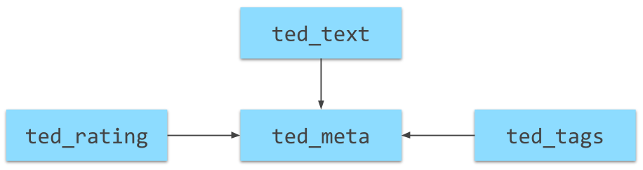

# \#0 Workspace Setup

## Databricks-Account erstellen

Databricks ist ein Cloud-Anbieter für Datenanalysen, unter anderem auf Basis von SQL. Databricks bietet einen kostenlosen Zugang über die so genannte Community Edition. Für die Teilnahme an diesem Tutorial müsst ihr euch ein kostenloses Databricks-Konto erstellen:

* ✅ Klickt auf 🔗[diesen Link](https://databricks.com/try-databricks), um auf die Anmeldeseite zu gelangen. 
* ✅ Klickt auf den "Get Started" Button auf der **rechten Seite** \(Community Edition\). 
* ✅ Gebt euren Namen ein und füllt die restlichen Felder aus:
  * Company Name = University of Applied Sciences Osnabrueck
  * Work Email = deine HS-Email-Adresse 📧 
  * Intended Use Case = Education - Teaching 👨🏫 
  * Your Role = Student 👩🎓  
* ✅ Ihr erhaltet eine Bestätigungsmail an eure angegebene Email-Adresse. Darin ist ein Link enthalten, mit dem ihr eure Anmeldung bestätigt und ein Passwort festlegt. 
* ✅ Loggt euch über 🔗[diesen Link](https://community.cloud.databricks.com/login.html) bei Databricks Community Edition ein.

Wenn der Login-Vorgang erfolgreich war ist die Anmeldung erfolgreich abgeschlossen✔.

## Notebook-Templates importieren

### Vorgehen

In Databricks arbeitet ihr stets in so genannten 🗒 **Notebooks**. Ein Notebook ist eine Abfolge von **Blöcken**, in denen Anweisungen wie z.B. SQL Abfragen enthalten sein können. Ein Code-Block kann gestartet🏃♀werden, woraufhin Databricks die enthaltenen Anweisungen Schritt für Schritt ausführt. Im Falle eines SQL Statements wird das Ergebnis \(bei Erfolg\) anschließend unter dem Block angezeigt.

Für dieses Tutorial stelle ich eine Reihe von Notebooks bereit, die ihr in euren Account importieren könnt. In diesen Notebooks sind alle Beispiele und Aufgabenstellungen enthalten. Ihr könnt eure Lösungen einfach unter die jeweilige Aufgabe als neuen Block einfügen.

Das Vorgehen zum Importieren eines Notebooks ist einfach:

* ✅ Klickt auf den Link des Notebook-Templates, z.B. 🔗[diesen Link](https://winf-hsos.github.io/databricks-notebooks/empirisches-arbeiten/3%20-%20Text%20Analytics.html). Das Notebook öffnet sich als HTML-Seite in einem neuen Tab des Browsers. 
* ✅ Klickt auf den "Import Notebook" Button in der oberen rechten Ecke des Notebooks. Es öffnet sich ein Pop-Up Fenster mit einer URL. Kopiert die URL in die Zwischenablage \(⌨_Strg+C_\). 
* ✅ Öffnet [Databricks](https://community.cloud.databricks.com/login.html) und loggt euch ein. Klickt im Menü links auf "Home" und wählt einen Ort aus, an dem ihr das Notebook speichern wollt. Klickt dann auf den kleinen nach unten zeigenden Pfeil und wählt "Import".  
* ✅ Im sich öffnenden Pop-Up Fenster wählt ihr den Radiobutton "URL" aus. Fügt nun die zuvor kopierte URL des Notebook-Templates in das Textfeld ein. Klickt anschließend auf "Import".

Wenn alles funktioniert hat ist das Notebook nun in eurem Account als Kopie gespeichert und ihr könnt damit arbeiten. Für jeden Abschnitt dieses Tutorials stelle ich ein separates Notebook bereit, das ihr importieren könnt.

### Liste der Notebooks

Hier die Links zu den Notebooks:

* 🗒 \#1 Der SELECT Befehl
* 🗒 \#2 Mehrere Tabellen
* 🗒 \#3 Mengenoperationen
* 🗒 \#4 Unterabfragen
* 🗒 \#5 Window-Funktionen
* 🗒 \#6 Texte
* 🗒 \#7 Statistische Funktionen
* 🗒 \#8 Datum und Zeit

## Daten anlegen

### Vorgehen

Das erste Notebook 🗒\#1 Der SELECT Befehl enthält zu Beginn einen Block für das vollautomatische Anlegen der benötigten Tabellen. Diesen Block müsst ihr einmalig ausführen. Anschließend habt ihr alle für dieses Tutorial benötigte Tabellen und Datensätze als Kopie in eurem Databricks Account. Auch nach einem erneuten Login sind die Daten und Arbeitsstände eurer Notebooks weiterhin vorhanden.

* ✅ Loggt euch in eurem Databricks-Account ein und klickt links im Menü auf "Cluster". 
* ✅ Klickt auf "Create Cluster". Vergebt einen beliebigen Namen für das Cluster und belasst alle anderen Einstellungen wie sie sind \(Runtime Version: 5.1, Python Version: 2\). Klickt auf den Button "Create Cluster". Es wird nun im Hintergrund ein Server für euch bereitgestellt, der die benötigte Software u.a. für das Ausführen von SQL Abfragen mitbringt. Die Bereitstellung dauert ca. 2-3 Minuten. Ihr erkennt an dem grünen Punkt vor dem Cluster-Namen, dass der Server bereitsteht.  
* ✅ Sobald das Cluster bereitsteht, öffnet das Notebook 🗒\#1 Der SELECT Befehl. Klickt in den Code-Block unterhalb der Überschrift "1. Daten laden" und drückt anschließend ⌨ _Strg+Enter._ Alternativ könnt ihr auch auf den kleinen Play-Button im oberen Rechten Menü des Blocks klicken. Beides führt den Code innerhalb des Block aus.

Nachdem der Block ausgeführt wurde stehen euch die 4 Tabellen für dieses Tutorial bereit:

* `ted_meta`
* `ted_ratings`
* `ted_tags`
* `ted_text`

### Datenmodell

Die Abbildung unten zeigt die 4 Tabellen und deren Beziehungen untereinander.

