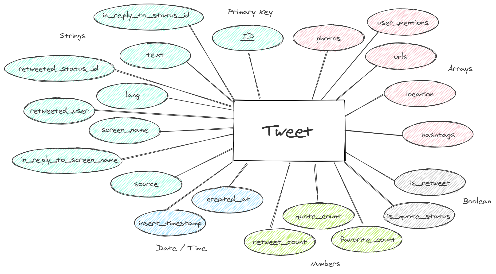

# Collect Data

To start a data analytics project, you obviously need data. There are different sources from which you can obtain data. If you are just playing around and want to learn, you can go to websites such as [Kaggle.com](https://www.kaggle.com/data) and download free and interesting data sets.

## Why Twitter Data?

In real life, however, the data doesn't just sit on a server, ready for you to download. More often than not, you must take care of collecting the data in the first place. In the project we are going to take as an example in the following sections, this data comes from the social media platform [Twitter](https://twitter.com/). Twitter lends itself well to being used in learning scenarios, for various reasons:

* The data is open and free.
* The data contains structured and unstructured elements \(text, images, videos\).
* We can perform network analysis due to Twitters many aspects that form networks \(follower, retweets, mentions\).
* The data covers many different data types such as numbers, strings, boolean, date and time, locations, and even complex data structures such as arrays and [JSON objects](../../coding-with-javascript/einfuehrung-in-json.md).
* Twitter covers real-time scenarios as well as a long history of data for batch scenarios.
* On Twitter, people discuss interesting topics, which makes it interesting from a content perspective.
* We can scale the data volume as required. We won't run out of data.

## The Twitter Collector Tool \(TDC\)

Collecting data from Twitter can be a difficult task. You would have to use their developer API and write your own program, which is a bit too much for a tutorial on data analytics. Therefore, I developed a little helper tool called **Twitter Collector Tool**, which you can use to create your own individual Twitter data set:




If you don't habe an account yet, you'll need to register and wait until I assign you a group. Let Notify me know on Slack to speed up the process.


