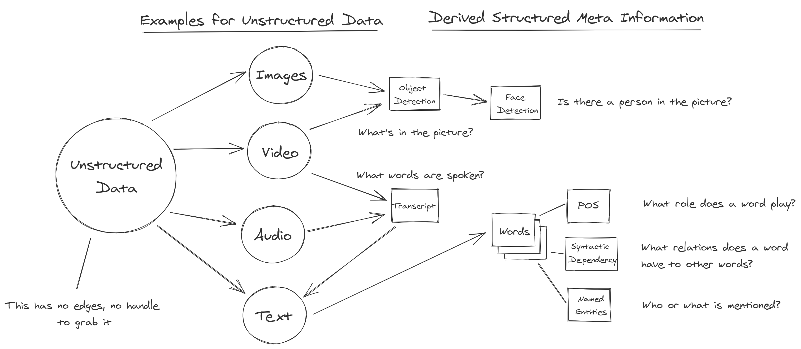

# Analyze Unstructured Data

The figure below contains some typical examples for unstructured data and what kind of structured data we can derive from it. Once we have the structured data, we can apply our standard techniques for analysis, such as calculations, counting, or filtering.

## Project structures on text data

### Words \(Tokens\)





### Parts of speech



### Named Entities



### Topics



