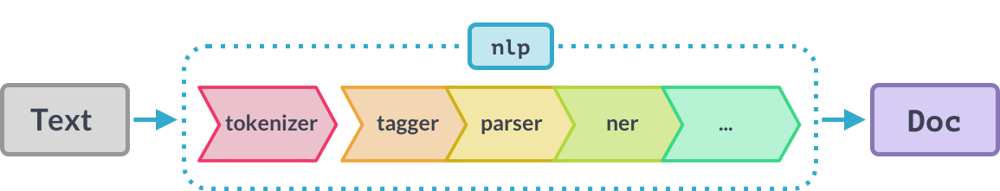

# Apply NLP

## Anwenden der NLP Pipeline

Nachdem wir spaCy installiert und ein passendes Modell \(hier: Englisch - klein\) geladen haben können wir uns eine erste einfache Anwendung anschauen:

```python
import spacy

# Load English model
nlp = spacy.load("en_core_web_sm")

# Define the text and store it on a variable
text = "I am looking forward to learning about NLP with spaCy!"

# Run NLP pipeline
doc = nlp(text)
```

Zunächst müssen wir das Modul mit dem `import` Befehl in unserem Programm bekannt machen. Anschließend definieren wir eine Variable `nlp` und laden eines der zuvor heruntergeladenen Sprachmodelle, um es danach auf einen Beispieltext anwenden zu können. Das erreichen wir, indem wie `nlp(text)` aufrufen, wobei die Variable `text` den zu analysierenden Text beinhalten muss. Im Hintergrund wird nun eine Abfolge von Schritten durchlaufen, die wir auch _Pipeline_ nennen. In jedem Schritt wird der Text weiter verarbeitet oder mit Informationen angereichert. Am Ende steht das Ergebnis des NLP-Prozesses, das wir im Beispiel oben auf der Variable `doc` speichern. Diese Variable erlaubt es uns nun, auf jedes Teilergebnis zuzugreifen.



## Zugriff auf die Ergebnisse

### Token

spaCy führt, wie oben gezeigt, beim Ausführen der `nlp()` Funktion unterschiedliche Operationen auf den Texten standardmäßig nacheinander aus. Der erste Schritt ist der t_okenizer_. Das Wort _tokenize_ bedeutet so viel wie den Text in einzelne kleine Blöcke zu unterteilen. Damit sind zum einen die Wörter gemeint, aber auch Satzzeichen oder Zahlen können ein Token sein. Die Trennung erfolgt ganz einfach anhand des Trennzeichens, was im Standard das Leerzeichen ist.

Das Ergebnis des _tokenizers_ liegt nach Ausführen der `nlp()` Funktion im Ergebnisobjekt `doc` vor:

```python
import spacy

# Load English model
nlp = spacy.load("en_core_web_sm")

# Define the text and store it on a variable
text = "I am looking forward to learning about NLP with spaCy!"

# Run the NLP process pipeline and save result on variable 'doc'
doc = nlp(text)

# Iterate over the tokens
for token in doc:
    # Print the text for each token
    print(token.text)
```

Im Codebeispiel oben wird ab Zeile 13 in einer Schleife Schritt für Schritt der Wert jedes Tokens ausgegeben. Wir können auf den Wert \(oder den Text\) des Tokens über `token.text` zugreifen.  


### POS-Tags

Ein Token hält neben dem reinen Text noch weitere Informationen für uns bereit. Dazu gehören die so genannten Part-of-Speech \(POS\) Informationen. Diese geben ab, welche Rolle ein Token \(oder Wort\) in dem Text spielt. Also ob es ein Verb, Adjektiv, Nomen oder vielleicht eine Zahl oder ein Satzzeichen ist. Auf diese Information können wir wie folgt zugreifen:

```python
# Iterate over the tokens
for token in doc:
    # Print the text for each token
    print(token.text)
    
    # Print the POS tag for each token
    print(token.pos_)
    
    # Print an emptpy line to separate tokens visually
    print()
```

Wir ihr seht enthält as `pos_` Attribut Abkürzungen für die Art des Tokens, den spaCy erkannt hat. Hier die wichtigsten davon:

| Abkürzung | Bedeutung |
| :--- | :--- |
| ADJ | Adjektiv |
| ADV | Adverb |
| AUX | Hilfsverb |
| NOUN | Nomen |
| PRON | Pronomen |
| PUNCT | Satzzeichen |
| VERB | Verb |

Eine umfassende Liste mit den verwendeten Tags und Kürzeln erhaltet ihr hier:




Für jedes Kürzel existiert auch eine Codierung als Zahl, die ihr über das Attribut `pos` \(ohne Underscore am Ende\) abrufen könnt.



Solltet ihr detailliertere Infos zur Rolle eines Tokens benötigen, schaut euch die Attribute `tag_` bzw `tag` an. Die Bedeutung der Werte in diesen Feldern könnt ihr auch dem obigen Link entnehmen.


### Benannte Entitäten

### Syntaktische Abhängigkeiten

