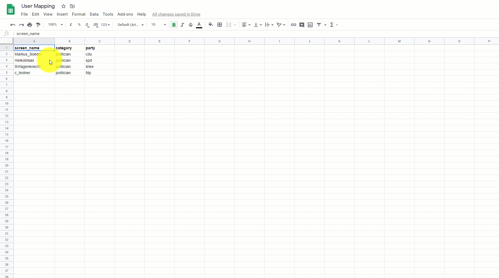

# Mapping Tables

## 💡 Erstellung einer einfachen Mapping-Tabelle mit Scala

### Einfache Listen mit Wörtern oder Zahlen

Ihr könnt ganz einfach eine eigene Tabelle erstellen, die ihr später in euren Analysen anstelle eine langen Liste wie bei `WHERE IN (...)` verwenden könnt. Dazu könnt ihr folgenden Scala-Code als Vorlage nutzen:

```scala
// Hier einfach in die Wörter durch eure ersetzen
val list = Seq("organic", "environment", "quality");

// Die einzige Spalte wird hier "word" genannt (gerne umbenennen)
val df = sc.parallelize(list).toDF("word");

// Zum Schluss wird ein temporärer View erzeugt mit dem Namen "myTable"
df.createOrReplaceTempView("myTable");
```

Anschließend könnt ihr den View wie eine Tabelle abfragen und für eure Analysen verwenden:

```sql
select * from myTable
```

### Eine Tabelle mit 2 oder mehr Spalten

Das Beispiel oben zeigt, wie man eine Liste als Tabelle mit einer Spalte anlegen kann. In einigen Fällen benötigt man aber 2 oder mehr Spalten, wie z.B. beim POS-Tagging. Hier braucht man eine Spalte für das Wort und eine für den Typ des Wortes \(Adjektiv, Substantiv, Nomen etc.\). Auch das geht einfach in Scala:

```scala
// Jetzt sind es Wortpaare, jeweils in eigenen Klammern mit Kommata getrennt
val list = Seq(("feed", "adjective"), ("food", "noun"), ("delicious", "adjective"))

// Nun benötigen wir auch 2 Namen für die Spalten
val df = sc.parallelize(list).toDF("word", "type")

// Und schließlich erzeugen wir wieder einen View
df.createOrReplaceTempView("myPosTable")
```

Wenn wir diesen View abfragen erhalten wir im Ergebnis 2 Spalten.

Das Beispiel ist beliebig erweiterbar. Ab einer zu großen Anzahl Spalten und Zeilen wird aber auch dieses Vorgehen schnell unübersichtlich. Dann ergibt es mehr Sinn, die Daten auszulagern, z.B. in ein Google Spreadsheet, und dieses dann automatisiert in Databricks zu importieren.

## 💡 Tabellen über Google Sheets pflegen und laden

###  Ein Google Sheet in Databricks laden

[Google Sheets](https://www.google.com/sheets/about/) ist eine kostenlose Alternative zu dem weit verbreiteten Microsoft Excel. Und weil Google Sheets in der Cloud und damit im Internet verfügbar sind, lassen sie sich in Databricks ohne komplizierte Umwege über den eigenen Rechner laden. Den folgenden Code-Block könnt ihr euch in euer Databricks-Notebook kopieren und in den Zeilen 2 und 6 die notwendigen Anpassungen durchführen:

```scala
import scala.sys.process._

// Choose a name for your resulting table in Databricks
var tableName = "stopwords"

// Replace this URL with the one from your Google Spreadsheets
// Click on File --> Publish to the Web --> Option CSV and copy the URL
var url = "https://docs.google.com/spreadsheets/d/e/2PACX-1vSWAaX6X1mcF7iCxFXE7dvwQHxb01L4CPlwgGPkmBYDLCsHozvANJBXs_sxlEJ37tAC-jBrZ0c7ADf2/pub?output=csv"

var localpath = "/tmp/" + tableName + ".csv"
dbutils.fs.rm("file:" + localpath)
"wget -O " + localpath + " " + url !!

dbutils.fs.mkdirs("dbfs:/datasets/gsheets")
dbutils.fs.cp("file:" + localpath, "dbfs:/datasets/gsheets")

sqlContext.sql("drop table if exists " + tableName)
var df = spark.read.option("header", "true").option("inferSchema", "true").csv("/datasets/gsheets/" + tableName + ".csv");
df.write.saveAsTable(tableName);
```

In Zeile 2 ersetzt ihr einfach den Wert `"stopwords"` mit dem Namen für eure eigene Tabelle. In Zeile 8 müsst ihr nun noch die öffentliche URL eures Google Sheets einfügen. Wie das geht erkläre ich im Folgenden.

### Ein Google Sheet als CSV veröffentlichen

Ihr legt in eurem Google Account ein neues Spreadsheet an und pflegt eure Daten in Spalten und Zeilen ein. Eben wie ihr es auch in Excel machen würdet. Wenn ihr dann einen Stand habt, den ihr gerne in Databricks als Tabelle laden wollt, geht ihr wie folgt vor:



**Schritt 1:** Ihr klickt auf "Datei" und dann "Im Web veröffentlichen"


**Schritt 2:** "Gesamtes Dokument" auswählen und im rechten Dropdown-Menü "Kommagetrennte Werte \(CSV\)" auswählen.


**Schritt 3:** Link kopieren und in Databricks einfügen \(Wert in Zeile 8 ersetzen\).


Nun müsst ihr nur noch den Code-Block ausführen und anschließend sollte die neue Tabelle verfügbar sein. Wenn ihr anschließend Änderungen im Spreadsheet durchführt und den Code zum Laden der Tabelle erneut ausführt, habt ihr alle Änderungen auch in Databricks verfügbar. Das erleichtert den Prozess, gerade wenn man iterativ Tabellen erstellt, die man sehr häufig in Databricks aktualisieren muss.


Das Veröffentlichen des Google Spreadsheet müsst ihr nur einmal ausführen. Änderungen, die ihr danach im Spreadsheet macht \(neue Zeilen hinzufügen\) werden automatisch veröffentlicht und sind beim nächsten Laden in Databricks vorhanden.


## 

