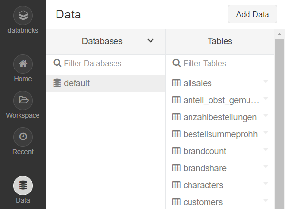
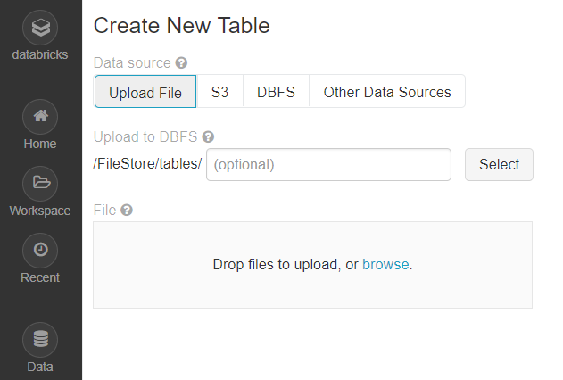
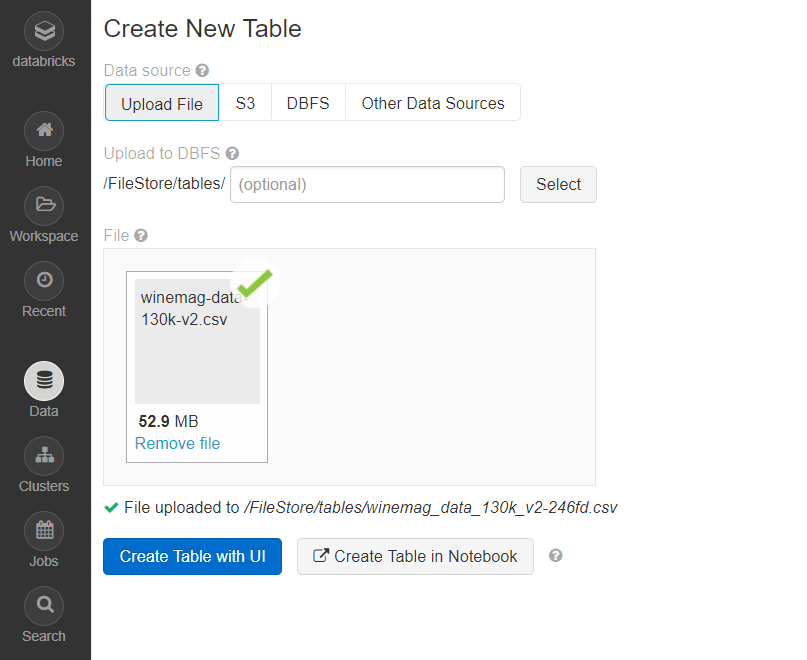

# Upload Data

## The DBFS

DBFS is short for _Databricks File System_. With your free account, Databricks also grants you free storage for your data sets.

The DBFS is structured just like your local Windows of Mac file system. It has folders and subfolders to store and organize files. When we upload new file using the Databricks UI, by default the data will be stored in the subfolder `FileStore/tables`. We can choose any subfolder underneath this path to store our data, but for our purposes, it is fine to simply store everything in this folder.


For more information on the DBFS, check out the [official documentation](https://docs.databricks.com/user-guide/dbfs-databricks-file-system.html#dbfs).


## Upload new data set to Databricks

We can upload a new file if we if naviagte to the "Data" tab in our menu on the left. Once we click on "Data", we see a list of existing databases and the contained tables \(if any tables exist\). In the upper-right corner, we see a button "Add Data", which takes us to a new dialog.



In this new dialog, we have several options to create a new table from data. Although the dialog is for creating tables, we can skip that and only upload new data \(we'll create a table later on\). To upload a new file, select the "Upload Files" button as shown below.



Now you can either drag & drop your file from your Window \(or Mac\) explorer to the gray box, or you can click "browse" to select the file from your hard drive.

Once the upload starts, you see a small green progress bar, and when it is finished, you see a bold green check mark as shown in the screenshot below.



When the upload completes, a small text appears right underneath the gray box that prints the destination path of the uploaded file. Make sure you copy this path, as we'll need this when we want to access this file from a notebook.


Make sure you copy the path where data is stored in DBFS! You will need this information later on. In the image above, the path is `/FileStore/tables/winemag_data_130k_v2-246fd.csv`

Should you forget or lose the path, you can browse through the files when you click on "DBFS" instead of "Upload File". When you click on a file, the path is shown as text.


## Import a data set from Amazon S3

When you have a relatively small data set \( &lt; 100 MB\), uploading it to DBFS as described above is the fastest way. If you have larger data sets, you can store them cheaply in Amazon S3, which is the cloud-storage offering by Amazon Web Services. From there, Databricks can directly read the data over a super-fast connection.

With S3 \(= Simple Storage Service\) and Databricks, you actually have 2 options:

1. Host the file publicy on S3, and from a Databricks notebook, copy the file into the DBFS. This is the way I provide you with files, as I have an Amazon S3 account and I already have the files we use in the courses uploaded there. With a small chunk of code, you can simply copy the file from my S3 drive to your Databricks account. This makes it faster, since you don't have to use your own internet connection to upload the file. Plus, it completely automates the task for you! \(**This is the relevant option**\)
2. Host the file securely on your own S3 account, and then authorize Databricks to read the file with your  Amazon credentials directly from S3, no copy to DBFS necessary. \(**This is not relevant for our purposes**\)

In the following, I'll explain the first option, because we use this option in our modules.

### Copy a file from a public URL to databricks

The code below copies a file from a public URL into your Databrick's DBFS and stores it in the folder `/datasets`. The code looks complicated, but the good news is you don't have to understand every bit of it. You just have to execute the code once and never touch it again. If you are interested to learn how it actually works, I'll briefly explain the code.



```scala
import scala.sys.process._

/* Declare some helper variables */
val tableName = "crimes"
val fileName = "Chicago_Crimes_2012_to_2017.csv.gz"
val localpath = "file:/tmp/" + fileName

/* Remove an old file if exists */
dbutils.fs.rm(localpath)

/* Copy the public file from Amazon S3 bucket */
"wget -P /tmp https://s3.amazonaws.com/nicolas.meseth/data+sets/" + fileName !!

/* Remove a possibly old file from the datasets folder */
dbutils.fs.rm("dbfs:/datasets/" + fileName)

/* Make sure the folder exists (does nothing if already there) */
dbutils.fs.mkdirs("dbfs:/datasets/")

/* Copy the file from temp folder to datasets */
dbutils.fs.cp(localpath, "dbfs:/datasets/")

/* List the file to make sure it worked */
display(dbutils.fs.ls("dbfs:/datasets/" + fileName))

/* Create a new dataframe from the file */
var df = spark.read.option("header", "true") 
                        .option("inferSchema", "true")
                        .csv("/datasets/" + fileName)

/* Rename columns with spaces in their name */
df = df.withColumnRenamed("_c0", "Number")
df = df.withColumnRenamed("Case Number", "CaseNumber")
df = df.withColumnRenamed("Primary Type", "PrimaryType")
df = df.withColumnRenamed("FBI Code", "FBICode")
df = df.withColumnRenamed("Updated On", "UpdatedOn")
df = df.withColumnRenamed("Location Description", "LocationDescription")
df = df.withColumnRenamed("Community Area", "CommunityArea")
df = df.withColumnRenamed("X Coordinate", "XCoordinate")
df = df.withColumnRenamed("Y Coordinate", "YCoordinate")

/* Cache dataframe for faster processing */
df.unpersist()
df.cache()

/* Drop the table if already there */
sqlContext.sql("drop table if exists " + tableName)

/* Save dataframe as a table, thus make the data permanent */
df.write.saveAsTable(tableName);
```



#### Copy the file

The first line imports a library that enables us to run the `wget` command in line 15. If we didn't import the `scala.sys.process._ library`, line 15 would fail.

In lines 4-6, we declare some helpful variables \(actually constants\) that we refer to later in the code. For example, we define a variable for the name of the file we are going to import. This is useful, because we need this file name in many susequent lines. With the f`ileName` variable, adapting the script for a new file name becomes as simple as changing as single value in line 5.

In line 9, we use the `dbutils` library from Databricks to delete a potential file with exactly the same name as the one we're about to copy. This is the case if you are re-importing the file and you run the script for the second time. If we didn't delete the file, we would receive an error in line 12, saying the file cannot be overwritten.

Line 12 does the main work. Here, we call the `wget` command, a linux command that lets you download files from the internet to your local machine. We invoke the command with 3 parameters \(or flags\). The flag `-P` indicates that we want to specify the location where to save the file. The location is the second parameter, and in this case we tell it to save the file to the default temporary folder `/tmp`. The third parameter is the URL from where to fetch the file. In this case, the URL points toa folder in my personal Amazon S3 bucket, which I made publicly available. It is important that the URL is publicly accessible, since we would receive an error otherwise.

After the `wget` command completes its work, we now have a local copy of the file in our `/tmp` folder. But this is not where we want the file to stay, because we want to keep the file longer and everyone knows that temporary folders may be deleted at any time. So we copy the file to its destination, which is the `/datasets` folder in our DBFS. This is what the lines 15, 18, 21, and 24 are about.

In line 15, we remove a potential file with the same name that we copied before. Again, this may be because we have run this script before. By the way, if the file does not exist, this command does nothing at all.

In line 18, we make sure that the destination folder exists. This is important, because otherwise we cannot copy the file there in line 21. If the folder exists, the command does nothing at all. Line 24 lists the file we just copied, and the result gives us an indication whether everything before worked properly.

That's it for the first part! We now have a copy of the file in our `/datasets` folder. Let's see how we can make the data in the file accesible.

#### Create a dataframe from the file

Once we have the file with the data in our Databricks file system \(DBFS\), we can access this file and create a data frame that contains the data from the file. Creating a data frame is simple:

```scala
var df = spark.read.option("header", "true") 
          .option("inferSchema", "true")
          .csv("/datasets/" + fileName)
```

A data frame is a type of object that [Apache Spark](https://winf-hsos.gitbook.io/module/~/drafts/-LJNRAhUNytf0xgugkpq/primary/information-management/challenge-1-explore-new-dataset/02-upload-data/overview#apache-spark) uses to work with structured data. \(Remember, Apache Spark is the underlying software of Databricks\).


Note that we can only create a data frame from the file because the data in the file is structured. It is in [CSV format](https://winf-hsos.gitbook.io/module/~/drafts/-LJNRAhUNytf0xgugkpq/primary/information-management/challenge-1-explore-new-dataset/01-data-sets#comma-separated-values-csv), which means that a line corresponds to a record, and the columns are separated by commas.

If the data wasn't that clearly structured, we could still read the data with Databricks. We would then need to create an RDD \(resilient distributed dataset\), which assumes no structure of the data. An RDD contains the raw data and we can access it line by line.


