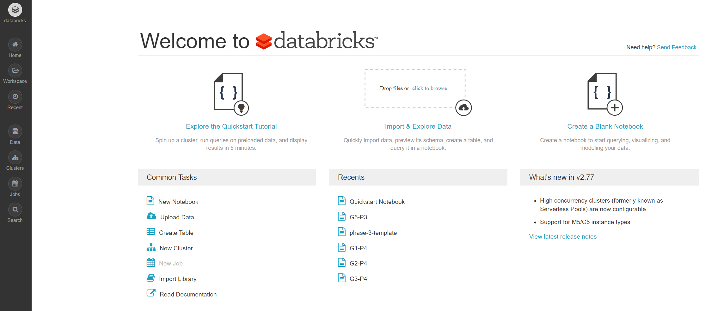

# Overview

## What is Databricks?

Databricks is based on an open-source software called [Apache Spark](https://spark.apache.org/). Apache Spark is a very popular software in industry which enables companies to perform processing and analysis of verly large data sets.

Databrick's offers Apache Spark as a cloud service. If you'd run Apache Spark on your own servers, you'd have to be an expert in installing and setting up a Spark Cluster. Plus, you'd have to make an investment into new hardware. We are neither experts in doing that, nor do we want to become them. Additionally, we only want to use Apache Spark during our course for a limited duration. Considering all these points, Databrick's offering is a great opportunity for us. The same arguments can be made for companies. 

A short introduction to Apache Spark is following an [upcoming section](apache-spark.md).

Because it runs in the cloud, you can use Databricks with all modern web browsers. \(I recommend [Chrome](https://www.google.de/chrome/)\). There is no need to install any desktop application. This is nice, as it means you can access Databricks from any computer. To use Databricks, you only need to create a free account. Use your university's e-mail address and sign-up [here](https://databricks.com/try-databricks).


On the [sign-up page](https://databricks.com/try-databricks), make sure you click on the **Community Edition** on the right side! You do not want the free trial of the Databricks Platform.


## Workspace

When you log into Databricks, you are taken directly to your workspace. More precisely, you'll see the landing page of your workspace. From there, you can perform many important actions right away:

* Create a new notebook
* Start a new cluster
* Upload data

On the left of the Databricks UI \(= User Interface\), you see the main navigation menu to access the different sections of the UI. The most important sections for use are _Home_ and _Workspace_, which are actually identical. Additionally, we need the _Data_ and _Cluster_ sections once in while to upload new data and start new clusters.

## Notebooks

## Clusters

## Must Reads

| Name | Comment |
| :--- | :--- |
| [Databricks UI Orientation](https://docs.databricks.com/getting-started/quick-start.html#step-1-orient-yourself-to-the-databricks-ui) |  |
| [Databricks User Guide - Workspace](https://docs.databricks.com/user-guide/workspace.html#workspace) |  |
| [Databricks User Guide - Notebooks](https://docs.databricks.com/user-guide/notebooks/index.html#notebooks) | Read the sections on create, import, export, and use notebooks. |

