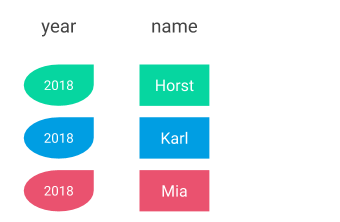

# Expressions

## Expressions

The general syntax of the SQL statement suggests that we can only put in column names for the first, and table names for the second placeholder. This is not the whole truth. We can also use expressions, which is a very powerful concept that I'll explain in this section.

An expression represents a value and can contain a combination of the following elements:

* Literal values
* Operators \(arithmetic, boolean\)
* Functions
* Columns

Moreover, an expression can also be a subquery that returns a \(single\) value. We'll cover subqueries [later](../../challenge-1-sales-data-analysis/advanced-queries/subqueries.md).

### Literal values

Instead of column names, we can select anything that represents a value. That means basically anything that we could fit into a column. Consider the example below:

```sql
SELECT 1 FROM person
```

What do you think the result would be? We are asking for a "1" from the table person. But when we run the query, we don't get only one "1", but instead we get 3! Why is that?

The explanation is simple: We get one "1" for every row in the table person. And as we have seen before, the table has three rows. Because there is no column with the name "1" in the table _person_, SQL interprets the "1" as a **literal value** and returns a new column with the value 1 for each row in the table.

In the example above, the new column does not have a name. We can assign a name easily:

```sql
SELECT 1 AS newCol FROM person
```

Now, the new column in the result set will be named `newCol`.


It doesn't have to be numbers, you can select literal values of any data type:

```sql
SELECT 'Hello World' as newStringCol FROM person;
SELECT true as newBooleanCol FROM person;
SELECT 0.5 as newDoubleCol FROM person;
```


You can try the example above on [SQL Fiddle](http://sqlfiddle.com/#!18/8c7c4/2)!



Note that the new columns won't be created in the source table when we select literal values. The new column will only exist in the result set, which is effectively also a table. A select statement can neither change the structure of an existing table, nor can it change the data in it.


#### Literals values and columns mixed

We can also mix both literal values \(or expressions\) and column names as we like:

```sql
SELECT 2018 as year, name FROM person
```

Imagine we want to save the result, and we want to add the `year` column to remember the year this report was created. This is the result:




You can try the example above on [SQL Fiddle](http://sqlfiddle.com/#!18/8c7c4/3)!


### Operators

#### Arithmetic

Another type of value we can select is an **expression**. An expression can be a function or a formula, anything that represents a value. A literal value is therefore a special case of an expression.

Typical expressions include arithmetic operations:

```sql
SELECT weight / height as relativeWeight FROM person
```

The above expression `weight / height` calculates a mesaure that puts the two attributes into relation. The more you weigh, the bigger the number, the taller you are, the smaller the number. As with literal values, we can combine column names and expressions in a single select statement:

```sql
SELECT name, weight / height as relativeWeight FROM person
```

This is the result:



You can try the example above on [SQL Fiddle](http://sqlfiddle.com/#!18/8c7c4/4)!


Accordingly, we can use any other arithmetic operator to perform calculations. Try the following statements:

```sql
SELECT weight - 10 as reducedWeight FROM person;
SELECT weight + 10 as increasedWeight FROM person;
SELECT weight * 2 as doubledWeight FROM person;
SELECT weight % 10 as moduloTenWeight FROM person;
```

#### Boolean

A booelan expression represents either `true` or `false`. Comparing two values \(or expressions\) is a typical scenario for a boolean expression. We can use the common operators:

```sql
SELECT 1 == 2 as alwaysFalse FROM person;
SELECT 1 == 1 as alwaysTrue FROM person;
SELECT weight > 60 as weighsMoreThan60 FROM person;
SELECT height <= 180 as isSmallerOrEqual180 FROM person;
SELECT name <> 'Horst' as notHorst FROM person;
```

### Functions

Functions can be invoked by their name and perform different tasks. In the end, every function represents a certain value. There are different types of functions in SQL, each type covers a set of scenarios:

* Math functions
* String functions
* Date & time functions
* Aggregation functions
* Window functions

Functions play a huge role in SQL, that's why we devote a separate section to date/time, aggregation and window functions. In the following, we'll introduce functions with simple math and string operations.

#### Math

Much of the calculations we need are covered by the arithmetic operators. However, there are some math functions that we'll use quite often:

#### String

