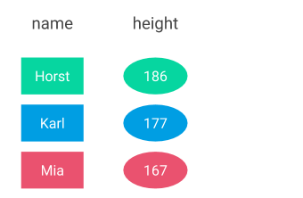

# Select

## Your first query

If you could talk to a database and ask for specific data, how would you formulate your reuqest? Engineers at IBM in the 1970s have probably asked themselves the very same question. As a result, they came up with the SQL select statement.

One idea behind the select statement is that users should write queries similar to how they would formulate the query in the English language. Consider we have a data set \(or table\) called _person_ with 3 columns and 3 rows:


Given this simple table, how would you formulate a request to get only the name and height of each person \(not the weight\)? You would probably say something like _"_**Give me only the name and height of each person, please"**_,_ right?

Now, let's consider the table more as set with elements \(rows\) and properties \(columns\) which we can choose from. We could then formulate it as "**I'd like to choose the name and the height from the person set**". That's very close to what it would look like in SQL. We only have to replace the verb "choose" with "select" and remove some fill words: "~~I'd like to~~ **select** ~~the~~ **name** ~~and the~~ **height from** ~~the~~ **person** ~~set~~". Instead of "and" we put a comma, and we have our first working select statement:

```sql
SELECT name, height FROM person
```

If we execute this statement against the database, the result looks like this:



That was easy, right? And so far quite intuitive and close to how we naturally speak. The good news is: The rest of the select statement's vocabulary follows the same rule of staying close to how we speak. That makes small and less complex queries very easy to read and write. The bad news: Once we arrive at a certain complexity, SQL statements can become large and very hard to read, despite the fact that it is at its core close to how we naturally speak. We'll find ways to deal with that later when we get there.


Note that the example above is oversimplified, but serves the purpose to show the main concepts of the select statement. The exercise of selecting 2 out of 3 columns may seem pointless in this scenario. But keep in mind that, in a real world data set, the number of columns can span between 10 to 100 or even more. Here, selecting only what you need becomes essential.



A sidenote: SQL and relational databases are mathematically founded in the [**relational algebra**](https://en.wikipedia.org/wiki/Relational_algebra). The relational algebra contains a number of operations that can be performed on data sets. The one we just learned about, namely selecting a subset of columns, is called **projection.**


## General syntax

In the example above, we learned about the most important part of every select statement: Which columns to select and from which table. We have seen this for the example of the person table above. In general, the select statement, as we know it so far, can be written as:

```sql
SELECT <columns> FROM <table>
```

Here, the two placeholders `<columns>` and `<table>` can simply be replaced with the existing values of table names and column names, and the statement becomes applicable to any table.

## The asterisk

The asterisk \(\*\) plays a special role in SQL. When applied instead of a list of column names, the result set contains all columns in the table:

```sql
SELECT * FROM person
```

Executing this statement returns the whole table:



The asterisk is useful to quickly get an overview of what's in a table. Be careful to use the operator in queries where it matters which columns are in the result set. When a new column is added to the person table, the same SQL statement returns a result set with four columns instead of three. This may be unexpected, and can cause unintended side effects. It is therefore best practice to specify the list of columns and not use the asterisk in production environments.


