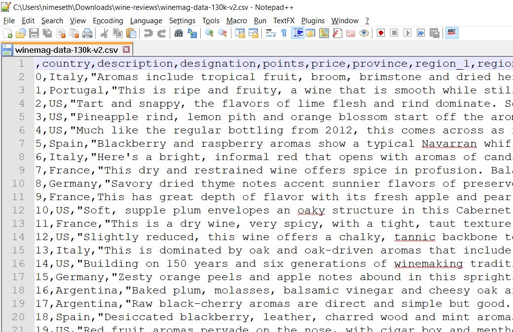

# Workspace Setup

## Register with Databricks Community Edition

For this course, you need a Databricks account, which gives you access to a cloud-based environment that lets you work with data in various ways.


**TASK:** If you don't already have an account, [sign up](https://databricks.com/try-databricks) for the free Databricks Community Edition! Make sure to choose the Community Edtion, **not** the free trial version!


## Import data sets to your Databricks account

During case A, you'll be working with the following data sets:

| \# | Data Set | Purpose | Notebook |
| :--- | :--- | :--- | :--- |
| 1 | Crimes in Chicago 2018 | Case Study | [Template - Crimes in Chicago 2018](https://winf-hsos.github.io/databricks-notebooks/information-management/Template%20-%20Crimes%20in%20Chicago%202018.html) |
| 2 | Wine Reviews | Examples and Exercises | [Template - Wine Reviews](https://winf-hsos.github.io/databricks-notebooks/information-management/Template%20-%20Wine%20Reviews.html) |
| 3 | Craft Beers | Examples and Exercises | [Template - Craft Beers](https://winf-hsos.github.io/databricks-notebooks/information-management/Template%20-%20Craft%20Beer.html) |

The first data set is part of the case study that you are going to solve in your group. All the other data sets serve as examples throughout the lessons. The goal is to illustrate methods and concepts using one data set, and then to transfer and extend upon that knowledge using another data set.

## Open the data set with your favorite editor

One nice thing about text files is you can open them with almost any editor. Windows ships with an editor called _Notepad_, which you could use to open the data set. However, if you want more features and a better experience, I highly recommend _Notepad++_, an open source text editor. You can download and install Notepad++ [here](https://notepad-plus-plus.org/download/v7.5.8.html).

Once installed, start Notepad++ and open the file containing the data set.


Depending on the file size, opening a large file in Notepad++ might take a short moment. Be aware that opening files &gt; 1 GB can be a problem, depending on how much RAM your computer has. You can try to open files of any size, if Notepad++ cannot open them it'll notify you.


When done loading, the editor content should look like this:

