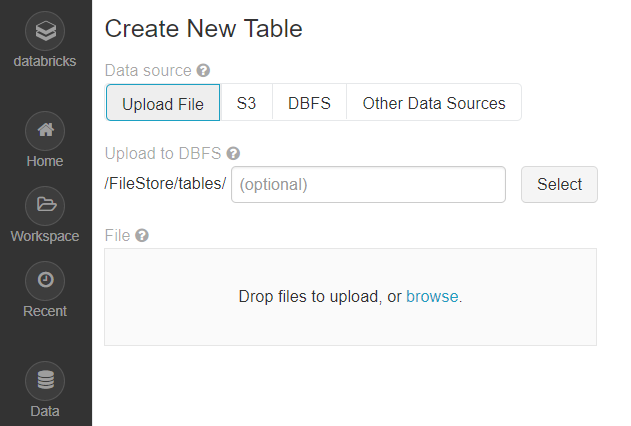

# 04 - Upload Data

## The DBFS

DBFS is short for _Databricks File System_. With your free account, Databricks also grants you free storage for your data sets.

The DBFS is structured just like your local Windows of Mac file system. It has folders and subfolders to store and organize files. When we upload new file using the Databricks UI, by default the data will be stored in the subfolder `FileStore/tables`. We can choose any subfolder underneath this path to store our data, but for our purposes, it is fine to simply store everything in this folder.


For more information on the DBFS, check out the [official documentation](https://docs.databricks.com/user-guide/dbfs-databricks-file-system.html#dbfs).


## Upload new data set to Databricks

We can upload a new file if we if naviagte to the "Data" tab in our menu on the left. Once we click on "Data", we see a list of existing databases and the contained tables \(if any tables exist\). In the upper-right corner, we see a button "Add Data", which takes us to a new dialog.

In this new dialog, we have several options to create a new table from data. Although the dialog is for creating tables, we can skip that and only upload new data \(we'll create a table later on\). To upload a new file, select the "Upload Files"  button as shown below.

Now you can either drag & drop your file from your Window \(or Mac\) explorer to the gray box, or you can click "browse" to select the file from your hard drive.

Once the upload starts, you see a small green progress bar, and when it is finished, you see a bold green check mark as shown in the screenshot below.

When the upload completes, a small text appears right underneath the gray box that prints the destination path of the uploaded file. Make sure you copy this path, as we'll need this when we want to access this file from a notebook.


Make sure you copy the path where data is stored in DBFS! You will need this information later on. In the image above, the path is `/FileStore/tables/winemag_data_130k_v2-246fd.csv`

Should you forget or lose the path, you can browse through the files when you click on "DBFS" instead of "Upload File". When you click on a file, the path is shown as text.


## Import a data aet from Amazon S3

When you have a relatively small data set \( &lt; 100 MB\), uploading it to DBFS as described above is the fastest way. If you have larger data sets, you can store them cheaply in Amazon S3, which is the cloud-storage offering by Amazon Web Services. From there, Databricks can directly read the data over a super-fast connection.

With S3 \(= Simple Storage Service\) and Databricks, you actually have 2 options:

1. Host the file publicy on S3, and from a Databricks notebook, copy the file into the DBFS. This is the way I provide you with files, as I have an Amazon S3 account and I already have the files we use in the courses uploaded there. With a small chunk of code, you can simply copy the file from my S3 drive to your Databricks account. This makes it faster, since you don't have to use your own internet connection to upload the file. Plus, it completely automates the task for you!
2. Host the file securely on your own S3 account, and then authorize Databricks to read the file with your  Amazon credentials directly from S3, no copy to DBFS necessary.

