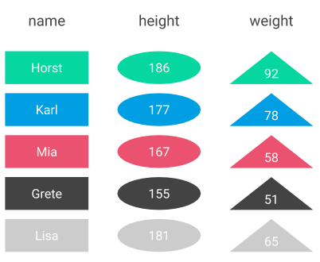

# Select

## Close to how we speak

If you could talk to a database and ask for specific data, how would you formulate your reuqest? Engineers at IBM in the 1970s have probably asked themselves the very same question. And the result was the SQL select statement.

One idea behind the select statement is that users should write queries similar to how they would formulate the query in the English language. Consider we have a data set \(or table\) called _person_ with 3 columns and 5 rows:



**PERSON**

| name | height | weight |
| :--- | :--- | :--- |
| Hans | 188 | 92 |
| Horst | 175 | 74 |
| Franz | 191 | 100 |
| Sonja | 162 | 55 |
| Lisa | 170 | 60 |

```sql
SELECT name FROM person
```


