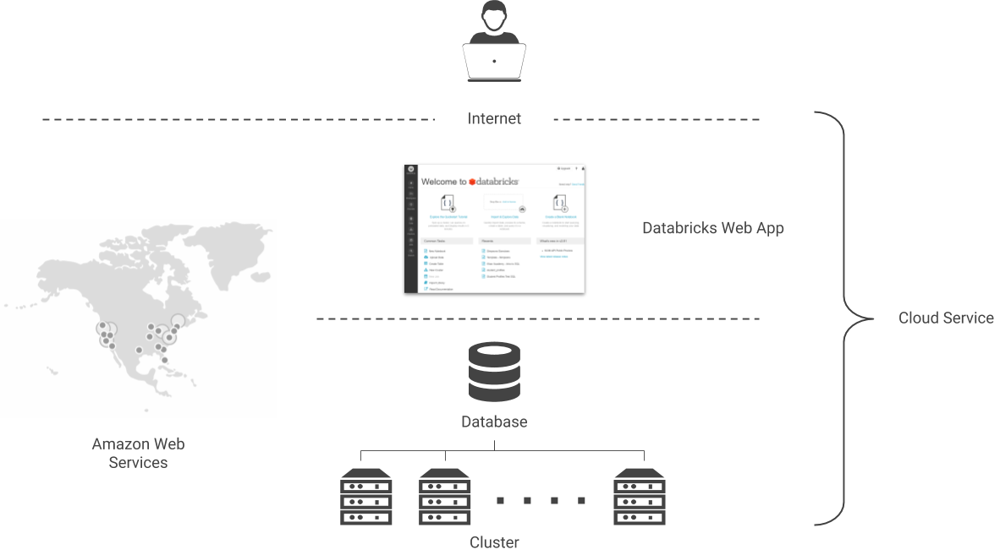

# Overview

## What is Databricks?

Databricks is based on an open-source software called [Apache Spark](https://spark.apache.org/). Apache Spark is a popular software in industry, which enables companies to process and analyze large data sets. A short introduction to Apache Spark follows in an [upcoming section](apache-spark.md).

Databrick's offers Apache Spark as a cloud service. If you'd run Apache Spark on your own servers, you'd have to be an expert in installing and setting up a Spark Cluster. Plus, you'd have to make an investment in expensive new hardware. We are neither experts in doing that, nor do we want to become them. Additionally, we only want to use Apache Spark during our course for a limited duration. Considering all these points, Databrick's offering is a great opportunity for us. The same arguments can be made for most companies. 

Because it runs in the cloud, you can use Databricks with all modern web browsers. \(I recommend [Chrome](https://www.google.de/chrome/)\). There is no need to install any desktop application. This is nice, as it means you can access Databricks from any computer. To use Databricks, you only need to create a free account. Use your university's e-mail address and sign-up [here](https://databricks.com/try-databricks).


On the [sign-up page](https://databricks.com/try-databricks), make sure you click on the **Community Edition** on the right side! You do not want the free trial of the Databricks Platform.


## Cloud Service

## Workspace

When you log into Databricks, you are taken directly to your workspace. More precisely, you'll see the landing page of your workspace. The landing page contains quick links to important actions:

* Create a new notebook
* Start a new cluster
* Upload data
* Create a new table

On the left side of the Databricks UI \(= User Interface\), you see the main navigation menu, which lets you access the different sections of the UI. The most important sections for us are _Home_ and _Workspace_, which are actually identical. From there, we can open our notebooks. Additionally, we need the _Data_ and _Cluster_ sections once in a while to upload new data and start new clusters.

For more information about the Databricks workspace, read the official documentation:

🔗 [Databricks User Guide - Workspace](https://docs.databricks.com/user-guide/workspace.html#workspace)

## Notebooks

Read the section of the Databricks official documentation about notebooks:

 🔗 [Databricks User Guide - Notebooks](https://docs.databricks.com/user-guide/notebooks/index.html#notebooks)

## Clusters

In the cluster section, we can create and start new clusters. A cluster is a connected set of one or more computers \(or nodes\). In Databricks, the cluster runs in the background, and we use it to execute our queries. All nodes in a Databricks cluster run Apache Spark on it.

The free community edition of Databricks lets us create a small one node cluster at no cost. Creating such a cluster is very easy, and we don't have to anything else in this section:

1. When you are in the cluster section, click the blue button _Create Cluster_
2. Choose a name for your cluster
3. Leave all other fields at their default value and click _Create Cluster_

In the background, Databricks fires up a new server on Amazon Web Services \(AWS\). This takes a couple of minutes. When the cluster is ready, you'll see a green circle and the state _running_. Your cluster is now ready, and you can attach your notebook to it.

## References

| Link | Must |
| :--- | :--- |
| [Databricks UI Orientation](https://docs.databricks.com/getting-started/quick-start.html#step-1-orient-yourself-to-the-databricks-ui) | ✔ |
| [Databricks User Guide - Workspace](https://docs.databricks.com/user-guide/workspace.html#workspace) | ✔ |
| [Databricks User Guide - Notebooks](https://docs.databricks.com/user-guide/notebooks/index.html#notebooks) | ✔ |

