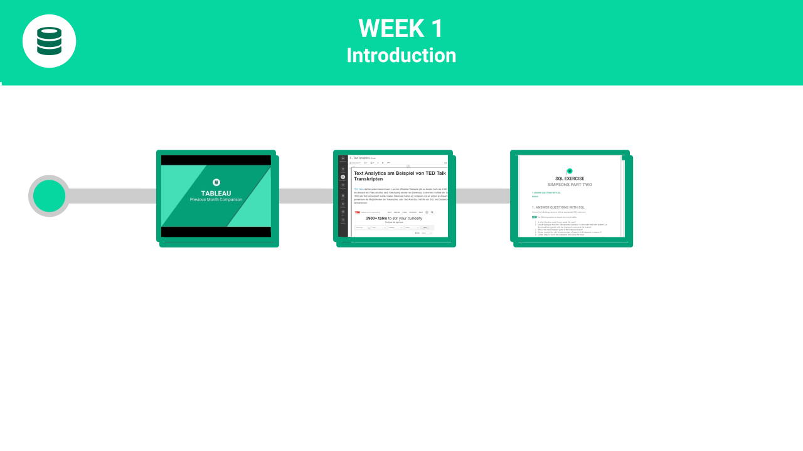

# Tableau

##  

## Online Documentation

For documentation and help on Tableau, refer to their [online help section](https://onlinehelp.tableau.com/current/pro/desktop/en-us/default.htm).



## Video Tutorials

Tableau offers a number of online videos. You must register for a free account, but then you can access all the content:



## Introduction

Tableau is [one of the most popular business intelligence tools](https://www.tableau.com/de-de/about/blog/2017/2/tableau-five-years-leader-gartners-magic-quadrant-analytics-66133) on the market. Watch the video below for a first introduction.



