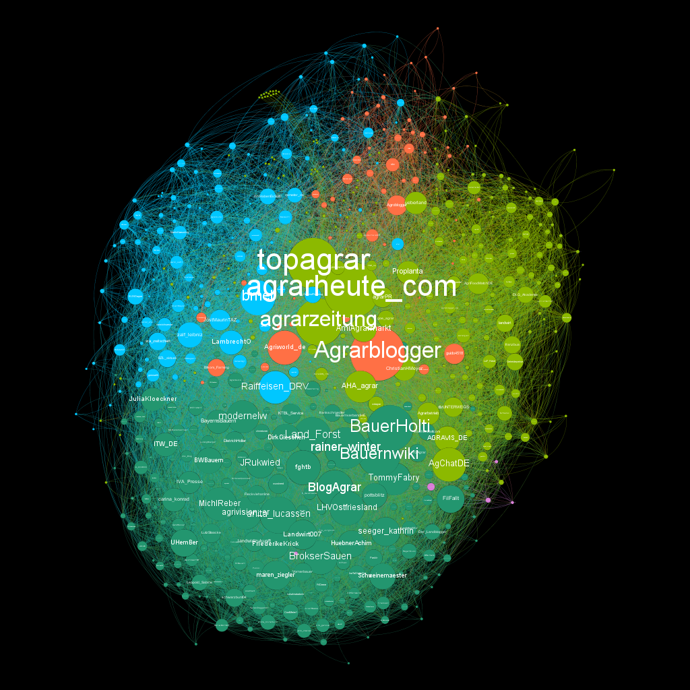

# \#5 Analyse sozialer Netzwerke

## 🎯 Lernziele

* 🎯 Ihr wendet Methoden zur Analyse von Netzwerk- und Themenstrukturen z.B. auf Twitterdaten an und extrahiert so weitere Informationen für die Beantwortung eurer Fragestellungen.

## ▶ Lerneinheit

Eine interaktive Version des Bildes unten findet ihr [hier](https://agrar-hashtags.glitch.me/).

##  

