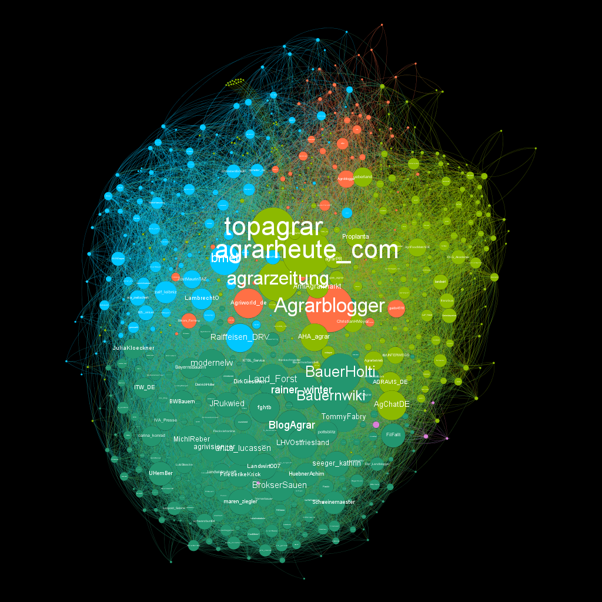

# Big Data Analytics

> Unter **Big Data** \(engl.: big data\) versteht man Datenkollektionen, deren Größe die Fähigkeiten einzelner Rechnersysteme überschreiten, um diese Datenmenge zu speichern, zu durchsuchen, zu analysieren und zu verwalten. \[1\]

## 🎯 Lernziele 

Folgt bald 🕟.

## 🇩🇪 Sprache

Die Sprache in diesem Modul ist Deutsch. Das verwendete Material \(Folien, Texte, Videos, Links\) kann aber auch englischsprachig 🇺🇲 sein.

## 📃 Konzept 

Die Veranstaltung basiert auf einer Fallstudie aus der Praxis, die in Gruppen von 3-4 Personen über das Semester hinweg bearbeitet wird. Die Fallstudie ist in 3 Phasen gegliedert. Am Ende werden die Ergebnisse im Plenum vorgestellt. Vorgelagert findet eine Einführung \(oder Auffrischung\) in SQL statt:

* 0⃣ SQL 
* 1⃣ Exploration und Grundlagen 🧭 
* 2⃣ Analyse von Texten 📄 
* 3⃣ Objekterkennung auf Bildern 🖼 

## 🎚 Level 

Es handelt sich um ein Einführungsmodul und es sind keine Vorkenntnisse notwendig 😄. 

* Kenntnisse im Bereich Datenbanken und SQL sind hilfreich.
* Die beiden Bachelormodule 👨🏫 Information Management und 👨🏫 Applied Analytics sind ideale Voraussetzungen.

Aber keine Angst, wir beginnen ganz von vorn. 😁 

## 🙀 Prüfungsleistung 

Die Prüfungsleistung besteht aus der Fallstudie \(70%\) und 2 kurzen MC-Tests im Semester \(jeweils 15%\). 

🤟 Es gibt keine Klausur am Ende des Semesters!

## 👩💻 Software & Accounts 

Ihr benötigt die folgenden Tools 🛠 und entsprechende Accounts. Sämtliche Tools sind kostenlos nutzbar:

* [Databricks Community Edition](https://community.cloud.databricks.com)
* [Indico.io](https://indico.io)

## 📑 Reader

Für diese Veranstaltung stelle ich über OSCA eine Sammlung von Texten bereit. Die Sammlung wird als ZIP-Datei 🗜 im Dateibereich hochgeladen. Folgende Texte sind enthalten:

* 📂 
  * 📑 2015 - Big Data - Chapter 4.3 - How Distributed Filesystems Work \(PDF \| 🇺🇲 \| 2 Seiten\)
  * 📑 2015 - Learning Spark - Chapter 3 - Programming with RDDs \(PDF \| 🇺🇲 \| 24 Seiten\)
  * 📑 2017 - Spark in Action - Chapter 1 - Introduction to Apache Spark \(PDF \| 🇺🇲 \| 15 Seiten\)

## 📚 Empfohlene Literatur

* 📘 Zečević, Petar; Bonaći, Marko \(2017\): Spark in action. Shelter Island, NY: Manning.  
* 📘 Marz, Nathan; Warren, James \(2015\): Big data. Principles and best practices of scalable real-time data systems. Shelter Island, NY: Manning. 
* 📘 Karau, Holden; Konwinski, Andy; Wendell, Patrick; Zaharia, Matei \(2015\): Learning Spark: Lightning-fast data analysis. 1. ed. Beijing: O'Reilly. 
* 📘 Struhl, Steven M. \(2015\): Practical text analytics. Interpreting text and unstructured data for business intelligence. London, UK, Philadelphia, PA: Kogan Page \(Marketing science series\). 
* 📘 Goodfellow, Ian; Bengio, Yoshua; Courville, Aaron \(2016\): Deep learning. Cambridge, Massachusetts, London, England: MIT Press. Online verfügbar unter [http://www.deeplearningbook.org/](http://www.deeplearningbook.org/).

