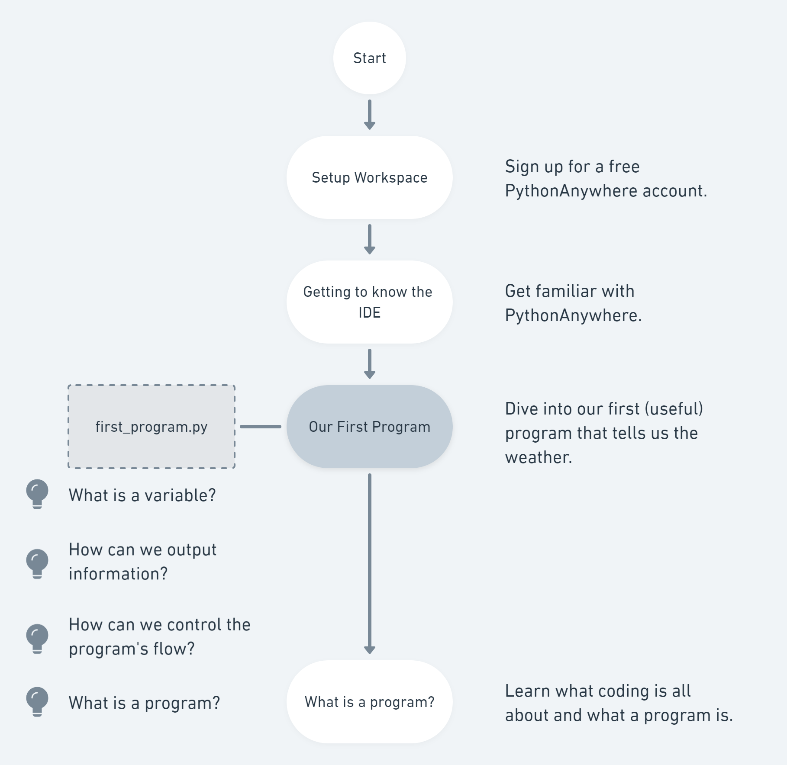

# Programming with Python

## Learning Path

At first, you need to setup your workspace and install Python and Visual Studio Code:



Once we have a working development environment, let's dive right in and write our first lines of code:



Now that we know what we're talking about, we'll try to get a more general understanding of what a program actually is:



## Links



