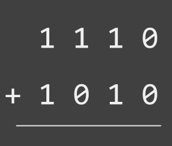

# 2 - Bits

## Adding Bits

|  | 4th Digit | 3rd Digit  | 2nd Digit  |  1st Digit |
| :--- | :--- | :--- | :--- | :--- |
| $$+$$  | 16 | 8 | 4 | 2 |
| \*\*\*\* | $$2^4$$  | $$2^3$$  | **1** | **0** |

### The same procedure as in decimal

The following figure shows a so called _half adder_. It consists of two logic gates connected to two input and two output bits.



