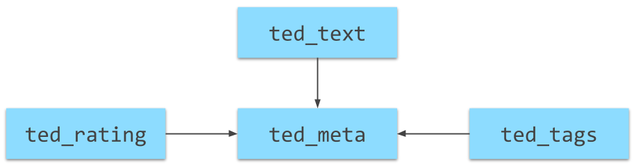

# Einführung SQL

Das folgende Tutorial führt SQL als Abfragesprache für strukturierte Daten ein. Als Beispieldatensatz verwenden wir einen aus 4 Tabellen bestehenden Datensatz zu TED-Talks. [Der Originaldatensatz wurde auf Kaggle.com veröffentlicht](https://www.kaggle.com/goweiting/ted-talks-transcript) und wurde für dieses Tutorial geringfügig angepasst.

## Übersicht

* 0⃣ Workspace Setup 💻 
  * ✅ Databricks-Account anlegen
  * ✅ Notebook-Templates importieren
  * ✅ Daten anlegen

## Datenmodell

Die Abbildung unten zeigt die 4 Tabellen und deren Beziehungen untereinander. Das Anlegen der Daten in eurem Databricks-Account ist vollautomatisiert und wird im ersten Schritt des Tutorials beschrieben.

