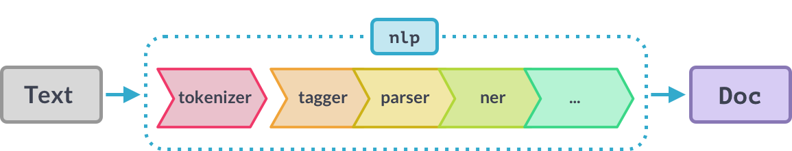

# NLP auf Texte anwenden

## Anwenden der NLP Pipeline

Nachdem wir spaCy installiert und ein passendes Modell \(hier: Englisch - klein\) geladen haben können wir uns eine erste einfache Anwendung anschauen:

```python
import spacy

# Load English model
nlp = spacy.load("en_core_web_sm")

# Define the text and store it on a variable
text = "I am looking forward to learning about NLP with spaCy!"

# Run NLP pipeline
doc = nlp(text)
```

Zunächst müssen wir das Modul mit dem `import` Befehl in unserem Programm bekannt machen. Anschließend definieren wir eine Variable `nlp` und laden eines der zuvor heruntergeladenen Sprachmodelle, um es danach auf einen Beispieltext anwenden zu können. Das erreichen wir, indem wie `nlp(text)` aufrufen, wobei die Variable `text` den zu analysierenden Text beinhalten muss. Im Hintergrund wird nun eine Abfolge von Schritten durchlaufen, die wir auch _Pipeline_ nennen. In jedem Schritt wird der Text weiter verarbeitet oder mit Informationen angereichert. Am Ende steht das Ergebnis des NLP-Prozesses, das wir im Beispiel oben auf der Variable `doc` speichern. Diese Variable erlaubt es uns nun, auf jedes Teilergebnis zuzugreifen.



## Zugriff auf die Ergebnisse

