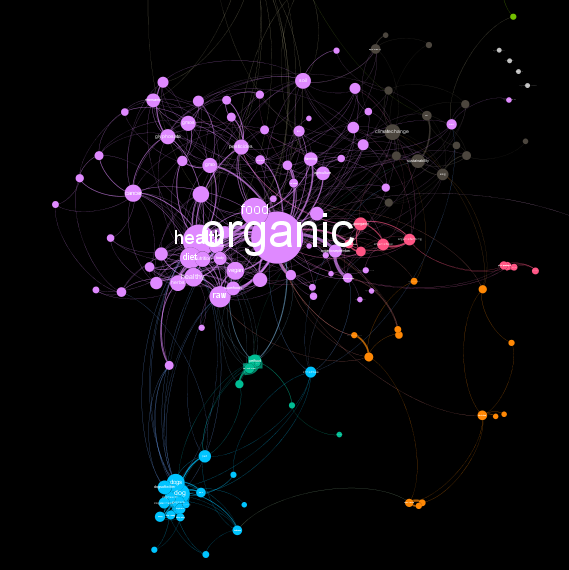

# Analyze Networks

## 💡 Aus Hashtags eine Themenlandkarte erstellen

Eine Möglichkeit, Themen in Twitter-Daten zu identifizieren, besteht darin, die Verwendung von Hashtags systematisch zu analysieren. Um speziell zusammenhängende Themen zu finden, bietet es sich an, die Hashtags zu zählen, die häufig paarweise auftreten. Visualisiert man anschließend die gefundenen Hashtag-Paare und deren Häufigkeiten in geeigneter Weise, so bekommt man eine **Themenlandkarte** der Twitter-Hashtags.



### View für Hashtags erstellen 👓 

Im ersten Schritt erstellen wir einen View in SQL, der uns aus den Tweets in der Tabelle `twitter_timelines` nur die Hashtags extrahiert und diese jeweils in einer eigenen Zeile mithilfe der `explode` Funktion darstellt:

```sql
create or replace view hashtags as
  -- Alle Hashtags in Kleinschreibung, um einfachere Vergleiche zu ermöglichen
  select id
        ,lower(hashtag) as hashtag
        ,created_at
  from (
    select id, explode(hashtags) as hashtag, created_at
    from twitter_timelines
  )
```

### View für das Zählen der Hashtag-Paare 👓 

Der folgende View gibt die Hashtag-Paar aller Tweets aus dem Jahr 2018 zurück. Die Erläuterungen zu dem relativ komplexen View erfolgt weiter unten:

```sql
create or replace view hashtag_pairs as
select distinct
   id
   ,case when h1 > h2 then h2 else h1 end as h1
   ,case when h1 < h2 then h2 else h1 end as h2 
   from (
     select h1.id
           ,h1.hashtag as h1
           ,h2.hashtag as h2 
     from 
        (select id, hashtag from hashtags where year(created_at) = '2018') h1
     inner join 
        (select id, hashtag from hashtags where year(created_at) = '2018') h2
     on h1.id = h2.id
     and h1.hashtag <> h2.hashtag
  )
```

Wir beginnen im Inneren des Views, genau genommen in den **Zeilen 11 und 13**. Hier werden mithilfe eines Joins die beiden gleichen Mengen, nämlich die Tweets aus dem Jahr 2018, miteinander verbunden. Die Krux liegt in der Join-Bedingung: Zum einen muss sichergestellt sein, dass die Hashtags aus dem gleichen Tweet stammen \(**Zeile 14**\), zum anderen sollen nur ungleiche Hashtags zu Paaren zusammengesetzt werden \(**Zeile 15**\). Wäre die zweite Bedingung nicht präsent, so bekämen wir jeden Hashtag eines Tweets im Ergebnis mit sich selbst gepaart.

Wir arbeiten uns nun nach Außen vor. Es erfolgt zunächst die Selektion der Tweet-ID \(**Zeile 7**\) sowie der Hashtag-Paare aus diesem Tweet \(**Zeilen 8 und 9**\). In der Abfrage ganz außen werden nun noch zwei Dinge sichergestellt:

1. Ein Paar soll jeweils nur in einer Variante im Ergebnis enthalten sein, und zwar das im Alphabet zuerst kommende Hashtag als Erstes \(h1\). Dafür sorgt das `case when` Statement in **Zeile 4 und 5**.
2. Sollte ein Tweet doppelt vorkommen, oder innerhalb eines Tweets Hashtags mehrfach vorkommen, so wollen wir jeweils nur ein Hashtag-Paar pro Tweet im Ergebnis sehen. Dafür sorgt das `distinct` in **Zeile 2**.

### SQL-Abfrage für den Export der Hashtag-Paar \(Gephi\)

Das Open Source Tool [Gephi](https://gephi.org/) erlaubt die Visualisierung von Netzwerken. Hashtag-Paare lassen sich ebenfalls als Netzwerk darstellen, wenn man folgende Annahmen trifft:

* Die Hashtags stellen die Knoten des Netzwerks dar. Die Größe eines Hashtags in der Visualisierung kann z.B. durch die absolute Häufigkeit bestimmt sein.
* Zwischen zwei Knoten \(Hashtags\) besteht eine Verbindung \(Kante\), wenn diese als Paar aufgetreten sind. Die Stärke der Verbindung kann durch die Häufigkeit bestimmt werden, mit der dieses Paar auftrat.

Um eine Netzwerk-Visualisierung in Gephi erstellen zu können benötigen wir zwei Datensätze, am besten im CSV-Format:

1. Eine Datei mit allen Knoten \(hier: Hashtags\) und deren Größe \(hier: absolute Häufigkeit\)
2. Eine Datei mit den Kanten \(hier: Hashtag-Paare\) und deren Stärke \(hier: Paar-Häufigkeit\)

#### Export der Knoten

Zuerst definieren wir einen View, der die von Gephi erwarteten Spalten \(`Id`, `Label`, `Size`\) beinhaltet:

```sql
create or replace view hashtag_export as
select hashtag as `Id`
      ,hashtag as `Label`
      ,count(1) as `Size`
from hashtags
where year(created_at) = '2018'
group by hashtag
-- Nur Hashtags, die häufiger als 20 Mal vorkamen
having count(1) > 20
```

Der View selektiert nur die Hashtags aus einem bestimmten Jahr und auch nur solche, die eine bestimmte Häufigkeit in diesem Jahr aufweisen. Das verringert die Anzahl Knoten in der Visualisierung und macht das Bild später deutlich besser lesbar.


Sowohl das Jahr als auch die Grenze, ab wann ihr ein Hashtag mit in die Analyse einbezieht, hängt stark von euren Daten ab und solltet ihr selbst ausprobieren.


#### Export der Kanten

Im zweiten Schritt nutzen wir den View `hashtag_pairs` von weiter oben und kombinieren ihn in der Abfrage unten mit dem View `hashtag_export`, den wir für den Export der Knoten verwendet haben. Wir bestimmen nun, dass jedes in den Paaren enthaltene Hashtag eines der Knoten sein muss \(**Zeile 5 und 6**\). Das ist auch für Gephi zwingend notwendig, da sonst die Daten inkonsistent wären.

```sql
select h1 as `Source`
      ,h2 as `Target`
      ,count(1) as `Weight`
from hashtag_pairs 
where h1 in (select Id from hashtag_export)
and h2 in (select Id from hashtag_export)
group by h1, h2
order by count(1) desc
```

### Import der Knoten und Kanten in Gephi

Folgt bald...

