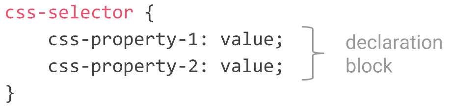

# CSS Rules

To style our website with CSS, we define so called _CSS rules_. A rule consists of a _CSS selector_ and a _declaration block_. 



A concrete CSS rule looks like this:

```css
h1 {
    color: green;
    font-size: 16px;
}
```


